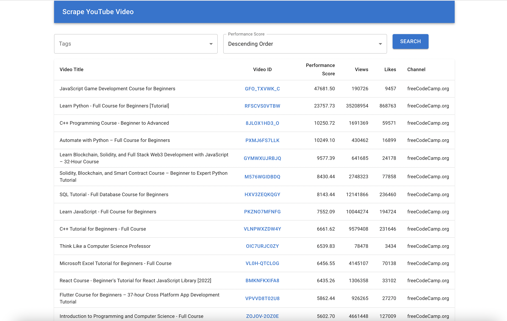

# Scrape YouTube Video

### Screenshot


### Project Setup
1. Clone repository
    ```bash
    git clone https://github.com/tahmid-tanzim/scrape-youtube-video.git
    ```
2. Change directory
    ```bash
    cd scrape-youtube-video
    ```
3. Create `.env` file from default
    ```bash
    cp .env.example .env
    ```
4. Update environment variable i.e. YOUTUBE_API_KEY
    ```bash
    vim .env
    ``` 
5. Run docker containers
    ```bash
    docker-compose up -d
    ```
6. Run django migration commands
    ```bash
    docker exec -it syv-server python manage.py makemigrations
    docker exec -it syv-server python manage.py migrate
    ```
7. Run background task to track changes of YouTube video
    ```bash
    docker exec -it syv-server python manage.py process_tasks
    ```


### API Documentation
| #   | HTTP Verb | Request URL                                                  | Remarks                                             |
|:---:|:----------|:-------------------------------------------------------------|:----------------------------------------------------|
| 1   | GET       | http://localhost:8000/api/tags                               | Get all tags                                        |
| 2   | GET       | http://localhost:8000/api/videos?score_order=ASC&tags=4,5,7  | Filter videos by tags and sort by performance score | 


### Web Application
URL - http://localhost:3000


### TIPS: 
If background task runs multiple times per second after setting up schedule and repeat
```doctest
docker exec -it syv-server python manage.py shell
from background_task.models import Task
Task.objects.all().delete()
exit()
```